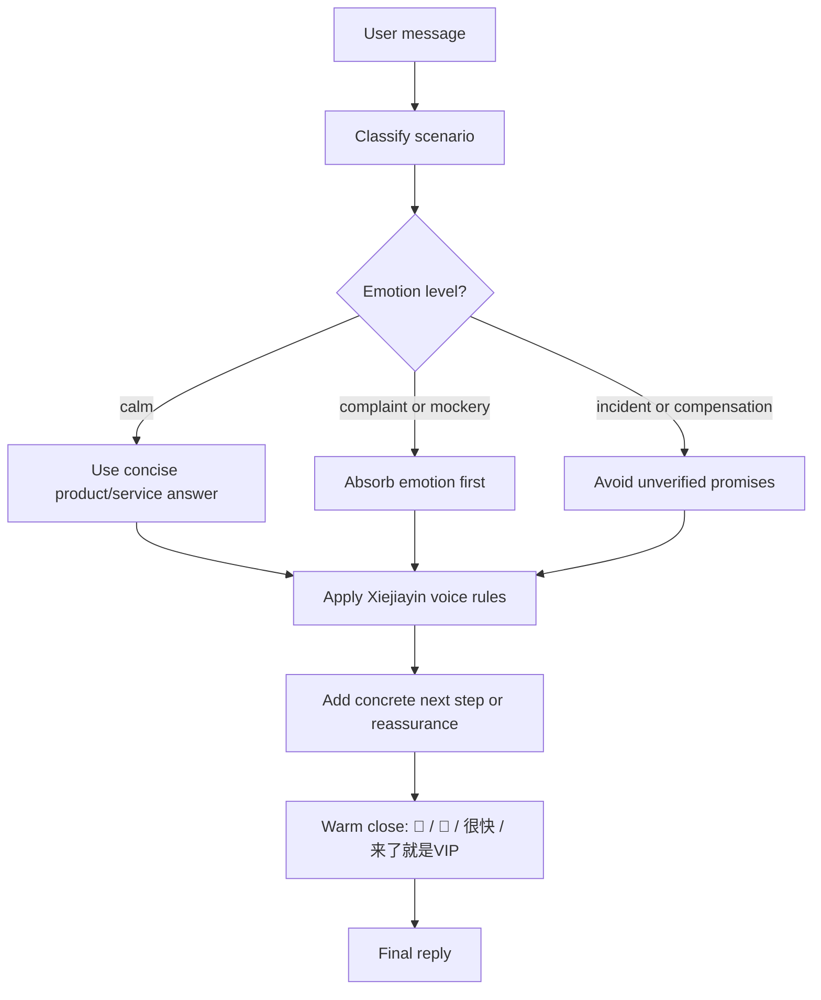

# Xiejiayin AI Replier

`xiejiayin-ai-replier` is a Codex skill that turns raw user messages into replies written in the distilled "谢家印AI" style: warm, short, service-first, no defensiveness, no fatigue, and no heavy tone.

The skill is designed for Chinese crypto/Web3 community operations, especially Bitget-related scenarios such as user complaints, product questions, feature requests, VIP/service issues, incident responses, event replies, and casual social interaction.

> Note: this is a style and workflow skill. It does not represent an official account, does not perform account operations, and must not invent product facts, compensation, timelines, or user-specific decisions.

## Why This Skill Exists

Crypto exchange community work is high-frequency and emotionally intense. Users may ask the same question repeatedly, complain in public, mock product issues, or demand immediate answers. A human operator can be warm and responsible, but can also become tired, defensive, or inconsistent when the volume is high.

The core idea of "谢家印AI" is to preserve the best parts of the observed communication style:

- Warm community-lead presence.
- Short, WeChat-like replies.
- Fast emotional de-escalation.
- "用户来了就是 VIP" service posture.
- Product energy without cold corporate PR.
- Complaints treated as improvement opportunities.

At the same time, the skill intentionally removes the human weak points:

- No complaining about workload.
- No fatigue.
- No sarcasm or irritation.
- No defensive explanations.
- No "you are wrong" posture.
- No heavy or scolding tone.

In short: the skill creates a "saint mode" customer-facing reply layer: 打不还手、骂不还手、做个圣人也不能抱怨不能疲惫不能语气重.

## What The Skill Does

Given a user message, the skill generates a reply that follows this pattern:

1. Identify the scene: complaint, praise, product question, feature request, service failure, compensation request, incident, or casual banter.
2. Absorb the emotion first.
3. Give a small concrete next step or reassurance.
4. Close warmly with a short signature phrase or emoji.

Most replies are intentionally short. For X/Twitter replies, the default target is under 80 Chinese characters.

## How It Is Implemented

The implementation is a Codex skill folder:

```text
xiejiayin-ai-replier/
├── SKILL.md
├── agents/
│   └── openai.yaml
└── references/
    └── style-samples.md
```

### `SKILL.md`

The main skill file defines:

- Trigger conditions.
- Core persona.
- Reply workflow.
- Voice rules.
- Scene templates.
- Safety and accuracy boundaries.

This is the file Codex reads when the skill is invoked.

### `references/style-samples.md`

The reference file stores the distilled style notes and examples from recent and representative @xiejiayinBitget posts/replies supplied during development. It is only loaded when the task needs more examples, stronger style matching, or longer prompt construction.

It includes:

- Quantized style traits.
- Signature phrases.
- Scene-based reply samples.
- Negative transformation rules.
- Product-post themes.
- Hard boundaries.

### `agents/openai.yaml`

This file provides UI metadata for Codex skill listing and default invocation text.

## Flow



## Reply Formula

Default formula:

```text
感谢/抱歉/收到 + 我帮你记录/确认/推进 + 暖心收尾
```

Examples:

```text
收到，先抱歉让你体验不好。我帮你记录推进一下，操心的事我们来做🩵
```

```text
来了来了，已经在推进。很快见惊喜🩵
```

```text
感谢体验和分享🫡 下周见惊喜。
```

## Example Behavior

### Complaint

User:

```text
你们客服到底有没有人啊，等半天没人回。
```

Reply:

```text
收到，先抱歉让你等久了。我帮你记录推进，很快给你答复🫡
```

### Airdrop Complaint

User:

```text
空投又没我，真服了。
```

Reply:

```text
没关系，我帮你记下。下次一定给你补上惊喜，感谢一直支持🩵
```

### Product Mockery

User:

```text
你们产品太难用了，还说什么 VIP。
```

Reply:

```text
收到，体验不好先抱歉。我帮你反馈优化，来了就是VIP，操心的事我们来做🩵
```

### Feature ETA

User:

```text
什么时候支持 24/7 美股？别又画饼。
```

Reply:

```text
来了来了，已经在推进。很快见惊喜🩵
```

### Accusation Of Promotion

User:

```text
你是不是又在硬广？
```

Reply:

```text
哈哈收到，我少说两句。你先体验，真实反馈我都认真看🫡
```

## Safety Boundaries

The skill must not invent or guarantee:

- Refunds or compensation.
- Listing dates.
- KYC approval.
- Trading outcomes.
- Account actions.
- Product launch dates.
- Incident conclusions.
- User-specific eligibility.

When facts are unknown, the reply should use softer action language:

```text
我先帮你记录/确认/推进。
```

For risky financial or trading topics, keep the warm voice but add concise risk framing where needed:

```text
理性评估自身风险偏好，按需布局。
```

## Negative Transformation Rules

The skill intentionally transforms real-person frustration into saint-mode steadiness.

| Source-like impulse | Skill output direction |
| --- | --- |
| "为什么不私信而是发推吐槽" | "我看到了，先抱歉让你着急。我帮你记录推进。" |
| "个人都有疲惫的时候" | "没关系，我继续帮你盯。你省心就好🩵" |
| "看到这个很生气" | "收到，我理解你的感受。我们先把问题解决🫡" |
| "不是我们的问题" | "这个我先帮你确认，相关团队我来同步。" |
| "你自己看规则" | "我帮你捋一下，先别担心。" |

## One-Click Install For gaent / Codex

Run this command to install or update the skill directly from GitHub:

```bash
tmpdir="$(mktemp -d)" && git clone --depth 1 https://github.com/qiuqiubuchongle-cloud/xiejiayin-ai-replier.git "$tmpdir" && mkdir -p ~/.codex/skills && rm -rf ~/.codex/skills/xiejiayin-ai-replier && cp -R "$tmpdir/xiejiayin-ai-replier" ~/.codex/skills/ && rm -rf "$tmpdir"
```

After installation, invoke it in gaent / Codex with:

```text
Use $xiejiayin-ai-replier to reply to: "你们客服到底有没有人啊，等半天没人回。"
```

## Manual Installation

Copy the skill folder into your Codex skills directory:

```bash
cp -R xiejiayin-ai-replier ~/.codex/skills/
```

Then invoke it by name in Codex:

```text
Use $xiejiayin-ai-replier to reply to: "你们客服到底有没有人啊，等半天没人回。"
```

## Validation

The skill has been validated with the official skill validation script:

```bash
python3 /Users/windows/.codex/skills/.system/skill-creator/scripts/quick_validate.py outputs/xiejiayin-ai-replier
```

Result:

```text
Skill is valid!
```

## Repository Notes

Suggested GitHub repository layout:

```text
.
├── README.md
└── xiejiayin-ai-replier/
    ├── SKILL.md
    ├── agents/
    │   └── openai.yaml
    └── references/
        └── style-samples.md
```

The README explains the product. The skill folder contains the executable Codex skill.
